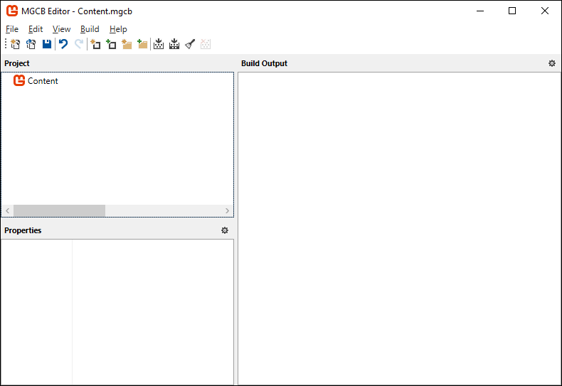
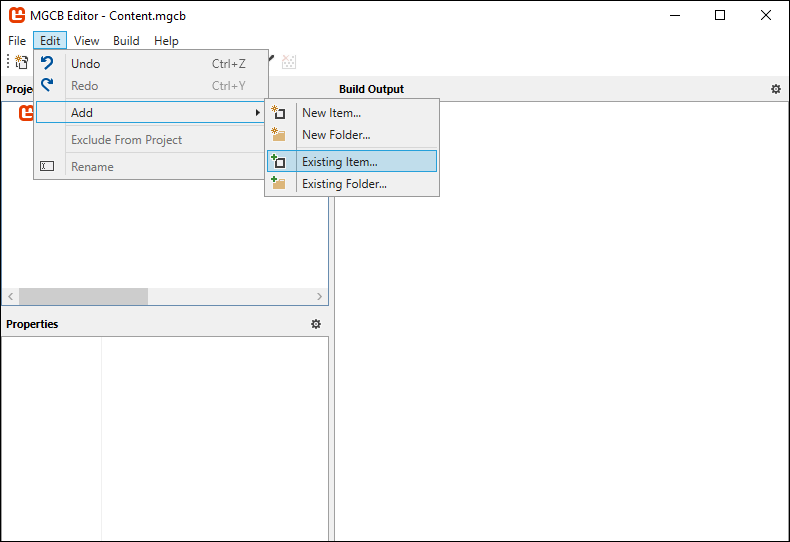
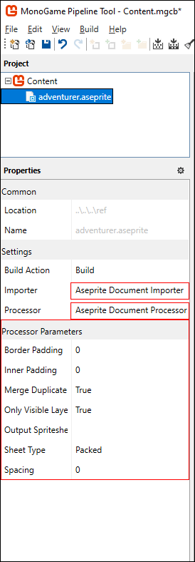

This serves to document how to add an Aseprite file to you game using the MGCB Editor.

## Adding the Aseprite File
Open the MGCB Editor by double clicking the `Content.mgcb` file the Solution Explorer window of your project.  Alternativly, you can open the MGCB Editor directly, then choose "File > Open" and select your game project's `Content.mgcb` file.

Next click "Edit > Add > Existing Item", the navigate to and choose the Aseprite file you wish to add.  

:::tip

When adding any content file in the MGCB Editor, you will be given the option of **copying the file to the directory** or **adding a link to the file**.

Due to the nature of working with your art files and constantly updating and changing them, I would recommend choosing to add a link instead of copying directly.

Doing this allows you to update the source file for changes, instead of now having to update the duplicate file that is created in the Content directory if you chose to copy the file.

:::

You should now see your Aseprite file listed under the "Content" node in the **Project** panel on the left. If you click on your file here, you should see in the **Properties** panel below that it is using the **Aseprite Document Importer** and the **Aseprite Document Processor**.  

There are also various **Processor Paramters** shown, which we'll go over in detail next.

:::note

If it says **Invalid / Missing Importer** and/or **Invalid / Missing Processor** instead, please ensure you followed the steps on the installation page and added the reference to the `MonoGame.Aseprite.ContentPipeline.dll` in the MGCB Editor.

:::

## Processor Parameters
When importing an Aseprite file, MonoGame.Aseprite provides various paramters that you can configure that change the final result of the file processing.  The following table can be used as a reference for what each parameter does.

| Parameter | Description |
|-----------|-------------|
| Border Padding | Adds space between each frame and the edges of the spritesheet. The value given is the number of pixels to add (i.e. 10 = 10 pixels) |
| Inner Padding  | Adds extra space inside each frame's edges. The value given is the number of pixels (i.e. 10 = 10 pixels). |
| Merge Duplicate Frames | When `true`, duplicate frames will be merged into one frame. Setting this can decrease the final size of the generated spritesheet if there are duplicate frames in your aseprite file animations. |
| Only Visible Layers | When `true`, only layers that are visible in the Aseprite file will be included in the generated spritesheet. |
| Output Spritesheet  | You can provide a file path here. If one is provided, the generated spritesheet will be output to the file path as a PNG file. |
| Sheet Type | Determines the type of spritesheet that is generated.  
| |`HorizontalSheet` will produce a spritesheet with a single row and a column for each frame. |
| |`VerticalSheet` will produce a spritesheet with a single column and a row for each frame.  |
| |`Packed` will generated a packed spritesheet using a square in box method. |
| Spacing | Adds space between each frame in the generated sprite sheet. The value given is the number of pixels (i.e. 10 = 10 pixels).

:::note

When changing the values of the **Processor Parameters**, the value doesn't "lock in" until you click off of the field. 

For instance, if you click to change the value of **Merge Duplicate Frames**, when you click it, a checkbox will appear that you can check or uncheck.  After making your change, if you click on another field, the checkbox goes away. Now, click the field again and the checkbox appears. Change the value, but this time instead of clicking another field, instead click the save icon at the top. Notice that the checkbox doesn't go away this time.

If that checkbox doesn't go away, this means the value didn't "lock in" even though you clicked save.  You need to click away on another field for the value to lock in.

:::

In the next document, we'll go over loading the imported Aseprite document in your game and how to use it.